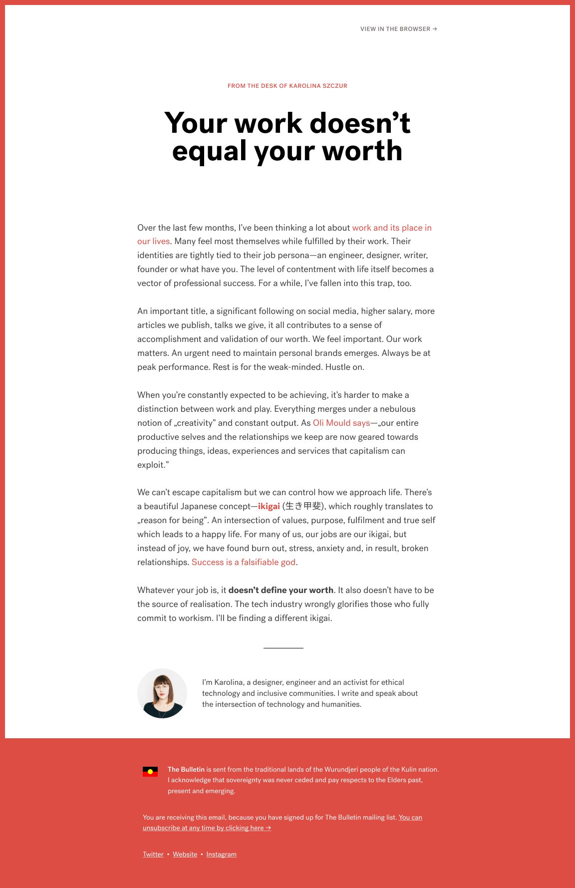

# The Bulletin Newsletter Template
A template for a personal newsletter, The Bulletin, covering the intersection of technology and humanities.

## Past issues

* [The Bulletin #4: Quitting Is A Win, Not A Failure](https://mailchi.mp/thefox/the-bulletin-4-quitting-is-a-win-not-a-failure)
* [The Bulletin #3: Your Work ≠ Your Worth](https://mailchi.mp/7480430cf807/the-bulletin-3-your-work-your-worth)
* [The Bulletin #2: Remote](https://mailchi.mp/c85e15c7c861/the-bulletin-2-is-remote-the-future)
* [The Bulletin #1: Against Burnout](https://mailchi.mp/2e6120ead82c/the-bulletin-1-against-burnout)

## Preview

## License
[MIT](LICENSE)
